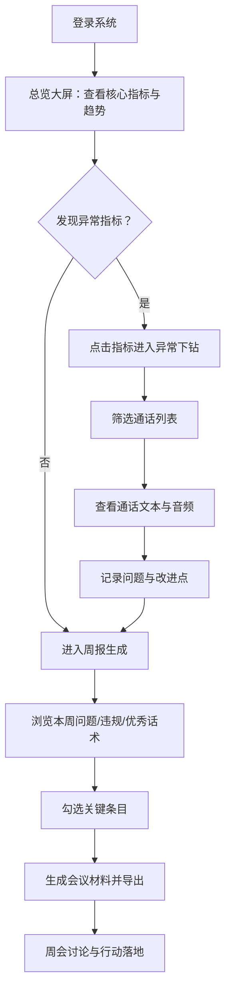

## 1. 产品概述

客服通话质检大屏系统，面向中大型客服中心管理层，将海量通话转写数据转化为可读的业务趋势与质量洞察。系统帮助管理者发现流程漏洞、培训盲点和服务质量问题，支撑周会决策。

- 目标用户：客服中心负责人、业务部门主管、培训经理
- 核心价值：从冷冰冰的数字转化为可追溯、可落地的质检行动

## 2. 核心功能

### 2.1 用户角色

| 角色 | 注册方式 | 核心权限 |
|------|---------|----------|
| 客服中心负责人 | 内部账号系统 | 查看全部大屏、生成周报、导出会议材料 |
| 业务部门主管 | 内部账号系统 | 查看本部门数据、下钻异常通话 |
| 培训经理 | 内部账号系统 | 查看违规/优秀话术、导出培训素材 |

### 2.2 功能模块

1. **总览大屏**：核心KPI指标卡、业务/坐席组分布、投诉高发词云、7日趋势对比、异常告警列表
2. **异常下钻**：代表性通话列表、通话文本片段高亮、音频播放控件、坐席维度分析
3. **周报生成**：本周常见客户问题、坐席高频违规句式、优秀安抚话术、勾选导出会议材料

### 2.3 页面详情

| 页面名称 | 模块名称 | 功能描述 |
|---------|---------|----------|
| 总览大屏 | 核心指标卡 | 展示当日/当周投诉率、平均打断次数、沉默时长异常占比、升级转人工率，支持点击下钻 |
| 总览大屏 | 趋势折线图 | 展示近7日/30日各指标趋势变化，支持多维度切换 |
| 总览大屏 | 投诉高发词云 | 动态词云展示投诉关键词，字号反映频次，点击可下钻 |
| 总览大屏 | 分布热力图 | 按业务类型×坐席组展示异常分布密度 |
| 总览大屏 | 实时异常告警 | 滚动展示最新检测到的异常通话条目 |
| 异常下钻 | 筛选条件 | 支持按日期、业务类型、坐席组、异常类型、客户评级筛选 |
| 异常下钻 | 通话列表 | 展示代表性通话摘要，含通话时长、坐席、异常标签、客户情绪评分 |
| 异常下钻 | 通话详情 | 左侧对话文本带时间轴和高亮异常片段，右侧音频播放控件 |
| 异常下钻 | 关联推荐 | 展示同坐席/同问题类型的其他关联通话 |
| 周报生成 | 问题汇总 | 本周Top10客户问题，按业务分类、频次排序 |
| 周报生成 | 违规句式 | 高频违规表达及其出现坐席、次数统计 |
| 周报生成 | 优秀话术 | 高分安抚话术及其所属坐席、上下文 |
| 周报生成 | 材料生成 | 勾选内容项，一键生成PDF/PPT格式会议材料 |

## 3. 核心流程

用户从总览大屏开始，观察异常指标 → 点击异常指标进入下钻页面 → 筛选并查看代表性通话的具体内容 → 在周报页面汇总本周发现 → 勾选关键条目生成会议材料 → 导出用于周会讨论。

## 4. 用户界面设计

### 4.1 设计风格

- 主色调：深空蓝 (#0B1D3A) 为背景基调，搭配警示橙 (#FF6B35) 标注异常，翡翠绿 (#10B981) 标记正常/优秀
- 辅色：科技感蓝紫渐变 (#4F46E5 → #7C3AED) 用于核心数据强调，冷灰 (#64748B) 用于次级文本
- 按钮风格：圆角方形 (8px)，填充色+细边框，hover时轻微上浮+发光阴影
- 字体：展示字体使用 "Space Grotesk" 营造科技大屏质感，正文使用 "Noto Sans SC" 确保中文可读性
- 布局风格：卡片式栅格布局，卡片带细微描边与玻璃拟态背景，信息密度高但层级清晰
- 视觉元素：数据可视化使用深色背景下的发光数据线，词云带动态粒子效果，异常告警带脉冲动画

### 4.2 页面设计概览

| 页面名称 | 模块名称 | UI 元素 |
|---------|---------|---------|
| 总览大屏 | 核心指标卡 | 大号数字 + 环比箭头 + 迷你趋势折线 + 背景发光渐变，点击时卡片放大动效 |
| 总览大屏 | 词云区域 | 动态词云容器，关键词hover时高亮并显示频次tooltip |
| 总览大屏 | 趋势图 | 双Y轴折线图，支持切换指标，数据点带脉冲动画 |
| 异常下钻 | 通话列表 | 横向卡片，左侧头像+状态标签，中间摘要+异常高亮，右侧操作按钮 |
| 异常下钻 | 通话详情 | 左右分栏，左侧聊天气泡式对话文本，右侧固定音频播放器 |
| 异常下钻 | 文本高亮 | 异常片段用橙色背景+黄色下划线标注，hover显示异常类型说明 |
| 周报生成 | 列表项 | 复选框 + 标签徽章 + 内容摘要 + 频次/评分数值，hover出现预览按钮 |
| 周报生成 | 生成面板 | 右侧浮动面板，显示已勾选条目数与进度，底部导出按钮 |

### 4.3 响应式

桌面端优先设计（1440px+），适配会议室大屏展示。在 1280px 以下自动调整栅格列数，确保可读性。

### 4.4 动画与交互
- 页面加载：卡片按瀑布流依次淡入（staggered fade-in）
- 数据更新：数字变化使用 countUp 动画平滑过渡
- 异常告警：新告警从右侧滑入，带脉冲发光边框
- 下钻跳转：点击卡片时元素先缩放然后页面切换，营造连续感
