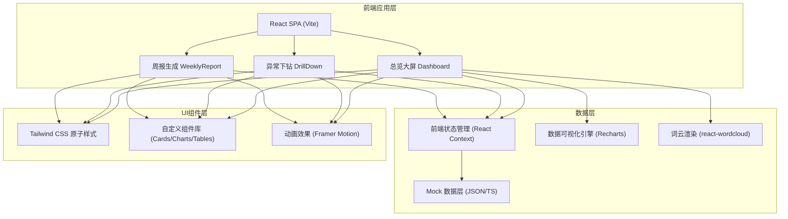
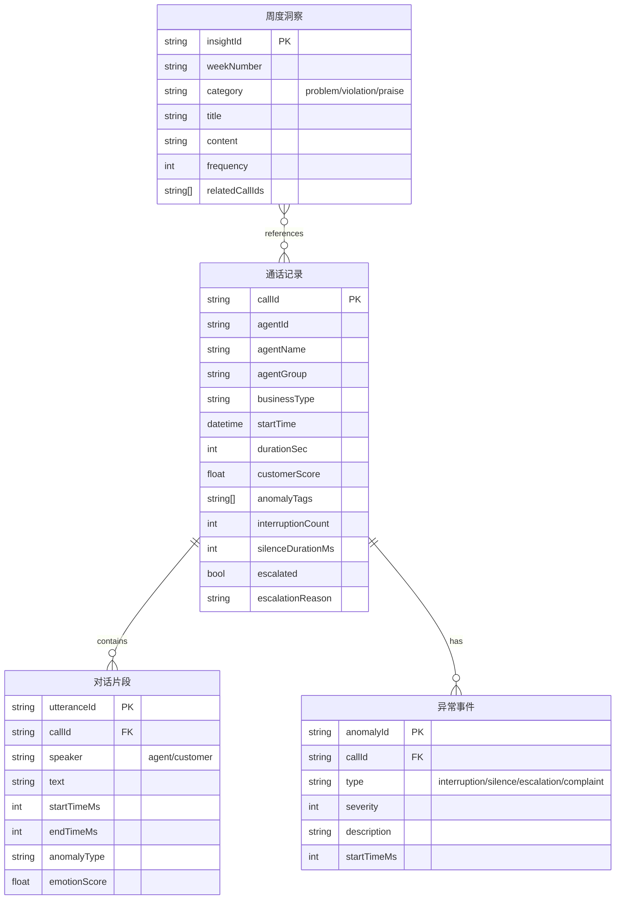

## 1. 架构设计



## 2. 技术描述

- **前端框架**：React@18 + TypeScript + Vite@5
- **样式方案**：TailwindCSS@3 + PostCSS
- **路由管理**：React Router DOM@6
- **数据可视化**：Recharts@2（折线图、柱状图、热力图）
- **词云组件**：react-d3-cloud
- **动画交互**：Framer Motion@11
- **状态管理**：React Context + useReducer
- **图标方案**：Lucide React
- **后端**：无后端，使用 TypeScript Mock 数据模拟
- **数据库**：无，全部数据内置于前端代码

## 3. 路由定义

| 路由 | 页面 | 用途 |
|------|------|------|
| `/` | 总览大屏 | 核心KPI指标、趋势图、词云、告警列表 |
| `/drilldown` | 异常下钻 | 通话筛选、列表、详情与音频播放 |
| `/drilldown/:callId` | 通话详情 | 指定通话的完整文本与音频 |
| `/weekly` | 周报生成 | 本周问题汇总、违规/优秀话术、材料导出 |

## 4. 数据模型

### 4.1 核心数据实体



### 4.2 TypeScript 类型定义

```typescript
interface CallRecord {
  callId: string;
  agentId: string;
  agentName: string;
  agentGroup: string;
  businessType: string;
  startTime: string;
  durationSec: number;
  customerScore: number;
  anomalyTags: string[];
  interruptionCount: number;
  silenceDurationMs: number;
  escalated: boolean;
  escalationReason?: string;
}

interface Utterance {
  utteranceId: string;
  callId: string;
  speaker: 'agent' | 'customer';
  text: string;
  startTimeMs: number;
  endTimeMs: number;
  anomalyType?: string;
  emotionScore?: number;
}

interface DailyMetric {
  date: string;
  totalCalls: number;
  complaintRate: number;
  avgInterruptions: number;
  silenceAnomalyRate: number;
  escalationRate: number;
}

interface WordCloudItem {
  text: string;
  value: number;
  category: 'complaint' | 'praise' | 'neutral';
}

interface WeeklyInsight {
  id: string;
  category: 'problem' | 'violation' | 'praise';
  title: string;
  content: string;
  frequency: number;
  relatedCalls: string[];
  agentName?: string;
}
```
